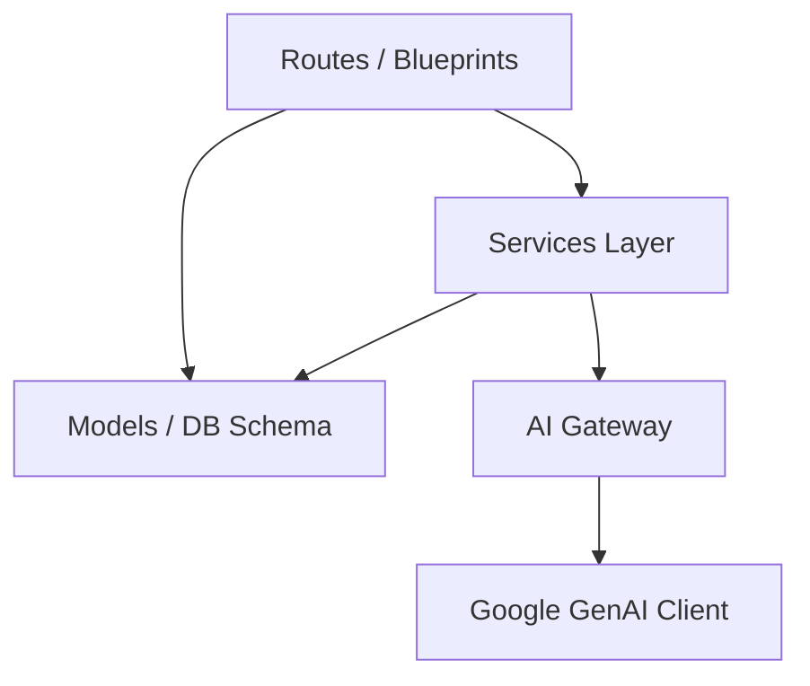

# Oplyra Architecture Rules

This document specifies the software architecture, folder structures, service interfaces, dependency rules, and data flow patterns for the Oplyra Flask application. All development must respect these architectural rules.

---

## 1. Directory Structure

Oplyra is built on a modular Flask Blueprint architecture. The codebase is organized as follows:

```
oplyra/
│
├── app/                        # Application Root Package
│   ├── __init__.py             # Application Factory, Blueprint Registrations, CSRF checks
│   ├── models.py               # Central Database Schema (SQLAlchemy Models)
│   │
│   ├── auth/                   # Authentication Blueprints & Controllers
│   │   ├── __init__.py
│   │   └── routes.py           # Register, Login, Forgot & Reset Password
│   │
│   ├── main/                   # Core Layouts Blueprints
│   │   ├── __init__.py
│   │   └── routes.py           # Home (Today Dashboard), Analytics APIs
│   │
│   ├── projects/               # Client Portfolios and Projects Blueprint
│   │   ├── __init__.py
│   │   └── routes.py           # Project CRUD API operations
│   │
│   ├── content/                # AI Generation, SEO Audits, Campaigns & Workflows Blueprint
│   │   ├── __init__.py
│   │   ├── routes.py           # Generation endpoints, Calendar, Tasks & Campaigns
│   │   └── enterprise_api.py   # Asset uploads, approvals, brand-kits, team logs
│   │
│   ├── services/               # Independent Service Interfaces Layer
│   │   ├── ai_gateway.py       # Central routing gateway for LLM APIs (caching & billing)
│   │   ├── ai_service.py       # Specific content generators (Blogs, Emails, Ad Copy)
│   │   ├── gemini_service.py   # Low-level connection client to Google GenAI SDK
│   │   ├── pdf_service.py      # PDF Report generators using ReportLab
│   │   └── seo_service.py      # SEO optimization evaluator
│   │
│   ├── static/                 # Static Assets (Style.css, main.js, images)
│   └── templates/              # HTML Templates (Base and Blueprint folders)
│
├── instance/                   # SQLite database location (local development)
├── backups/                    # Redesign file backups
├── run.py                      # Application bootstrap entry point
└── config.py                   # Multi-environment configurations (Dev, Prod, Test)
```

---

## 2. Layered Architecture & Dependency Rules

### A. The Dependency Hierarchy
Dependencies must flow **downward**:
- **Routes / Blueprints** (HTTP layer) depend on **Services** and **Models**.
- **Services** depend on the database models and **AI Gateway**.
- **AI Gateway** depends on **Flask Configuration** and the **Google GenAI client library**.



### B. Service Layer Design
All business logic must reside within services (found in `app/services/`). Routes must not calculate hashes, formulate raw prompt bodies, parse HTML strings, or call external services directly.
- **Example**: `app.content.routes` gets a form request, calls `GeminiService().generate_blog()`, and commits the returned text using `Content` model.

---

## 3. Strict AI Gateway Rules

> [!IMPORTANT]
> **Zero Direct AI Calls**: No code in the application may import the `google.genai` client, construct `types.GenerateContentConfig`, or call the Gemini API directly outside of [ai_gateway.py](file:///c:/Users/Akshay/genny%20ai/app/services/ai_gateway.py). 

All AI generation tasks must route through `AIGateway` to ensure the following safeguards:

1. **Usage limits**: Enforcing credit limits on a user level (`_check_rate_limit`).
2. **Caching**: Checking Redis (24-hour expiration) and fallback database cache (`ai_response_cache` model) before calling the Google Gemini API.
3. **Billing logs**: Recording input/output tokens and calculated usage costs inside `TokenBillingLog`.
4. **Mocking Support**: Graceful mock responses when placeholders/invalid API keys are detected (`GEMINI_API_KEY = "your_key_here"`).

---

## 4. Caching Strategy
Caching is implemented as a dual-layer strategy inside `AIGateway`:
- **Active Layer**: Redis cache (`REDIS_URL`). Used for hot performance lookups with automatic TTL.
- **Persistent Fallback**: SQL database cache table (`ai_response_cache`). Used in local dev environments where Redis is not active, allowing caching of expensive prompts.

---

## 5. Scalability & Multi-Provider Strategy
- Models are configured dynamically via string variables (e.g. `gemini-1.5-flash`, `gemini-1.5-pro`).
- To integrate future multi-provider platforms (e.g., Anthropic, OpenAI), the system must expand `AIGateway` to wrap other provider libraries. The blueprint routes must remain decoupled and unchanged by continuing to use the `GeminiService` abstract methods.
