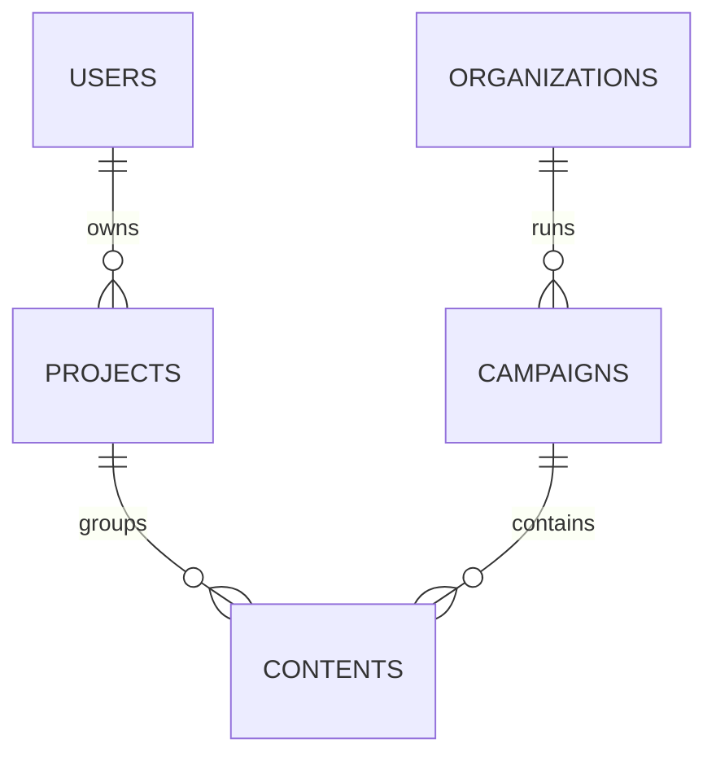

# Oplyra Database Rules

This document outlines the database design principles, schema rules, foreign key structures, audit tracking patterns, and version control procedures for Oplyra.

---

## 1. Database Philosophy & Dialects
Oplyra utilizes SQLAlchemy ORM with multi-dialect support:
- **Local Development**: SQLite (`instance/dev.db`). Lightweight, file-based, and zero setup.
- **Production Staging/Production**: MySQL/MariaDB.
- **Data Integrity**: Avoid writing dialect-specific raw SQL (e.g., MySQL `LONGTEXT` is defined dynamically via `db.Text().with_variant(LONGTEXT, "mysql")` to ensure cross-platform compatibility).

---

## 2. Naming Conventions & Rules

- **Tables**: Snake-case, plural (e.g., `users`, `projects`, `campaigns`, `contents`, `token_billing_logs`).
- **Columns**: Snake-case, singular (e.g., `user_id`, `created_at`, `password_hash`).
- **Foreign Keys**: Named as `table_name_id` mapping to the primary key of the parent table.
- **Indices**: Automatically index any columns frequently used in WHERE conditions, JOINs, or ORDER BY queries:
  - Indexed columns: `users.username`, `users.email`, `password_reset_tokens.token`, `contents.project_id`, `contents.campaign_id`.

---

## 3. Strict Campaign & Asset Ownership Rules

To secure client and campaign contexts, data ownership must be strictly enforced at the schema level:

1. **User Ownership**: Every `Project` has a foreign key `user_id` pointing to `User`.
2. **Campaign Nested Entities**: Every `Campaign` has an `organization_id` reference.
3. **Asset References**: Any generated asset (e.g. `Content`) must point to:
   - A `project_id` (not null, cascades on project deletion).
   - An optional `campaign_id` (sets to null if campaign is deleted).
   - An optional `organization_id` (nested context validation).
4. **Cascades**: When deleting a parent User or Project, we must perform cascade deletes on dependent tables (`cascade='all, delete-orphan'`) to prevent orphaned rows.

---

## 4. Cost and Token Tracking Schema
The database tracks consumption patterns via these dedicated structures:
- **`TokenBillingLog`**: Records token usage stats per request:
  - `user_id` (associated user).
  - `model_used` (e.g. `gemini-1.5-flash`).
  - `input_tokens` / `output_tokens` (raw count).
  - `calculated_cost` (exact HSL pricing estimates).
- **`UserRateLimit`**: Stores active limits:
  - `monthly_credits_limit` (max tokens).
  - `credits_used` (cumulative monthly token count).
  - `reset_date` (reset period date).

---

## 5. Audit Logging & Soft Deletes

### A. Audit Logging
Any action modifying critical resources (e.g., changing passwords, updating API keys, creating client organizations, updating budgets) must insert a record into the `AuditLog` table:
- Record fields: `user_id`, `organization_id`, `action` (e.g., "USER_LOGIN", "UPDATE_CAMPAIGN_BUDGET"), `ip_address`, and a `details` string.

### B. Soft Deletes
For user-facing elements like client profiles or major campaigns, consider implementing soft-delete structures:
- Add a nullable `deleted_at` DateTime column.
- Filter out deleted records by default (`Query.filter(Model.deleted_at == None)`).
